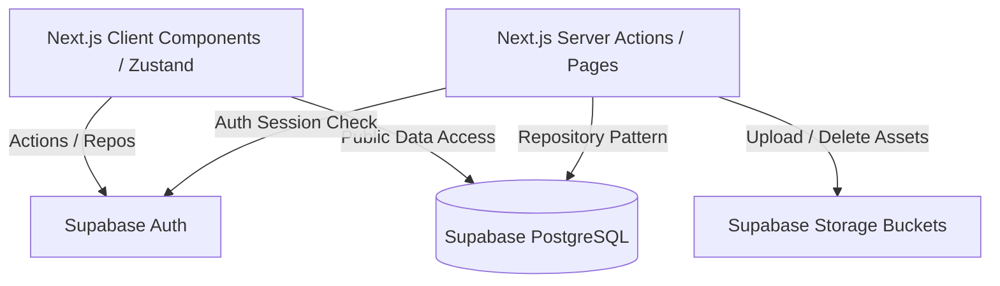
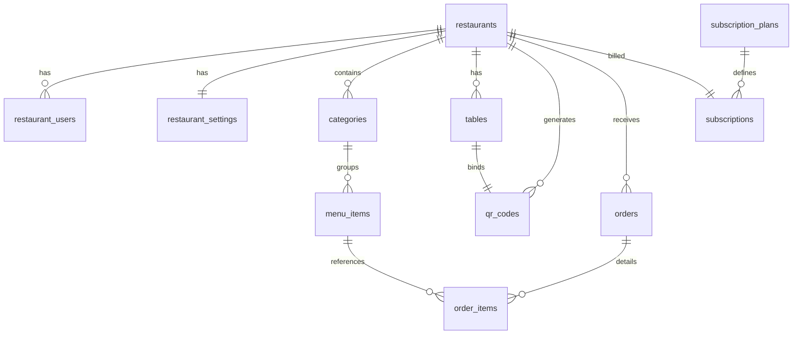

# Restreasy → Supabase Backend Integration Documentation

This document describes the architectural layout, database models, storage organization, Row-Level Security (RLS) configuration, local setup, and migration checklist to transition the Restreasy frontend prototype to a live, production-ready Supabase backend.

---

## 1. Architecture Overview

Restreasy uses a hybrid Next.js 16 App Router architecture paired with Supabase:
*   **Frontend**: Next.js 16 server-rendered pages and interactive React client components styled using Tailwind CSS v4.
*   **State**: Zustand stores handle non-persistent guest interface states (cart, filters, mobile UI drawers).
*   **Backend & DB**: PostgreSQL hosted on Supabase, accessed securely via standard queries and RLS policies.
*   **Authentication**: Supabase Auth handles registrations, login sessions, password resets, and session refreshes via Server Client cookies.
*   **Storage**: Supabase Storage holds logos, menu images, and generated table QR codes.
*   **Middleware**: Intercepts route requests on the server, enforcing login/role assertions before rendering `/dashboard/*` or `/super-admin/*`.



---

## 2. Database Design

A relational schema designed for scalability, multi-tenancy, and security.

### Master & Config Tables
*   **`subscription_plans`**: Defines tiers (`STARTER`, `GROWTH`, `PREMIUM`) and rates.

### Core Tenant Tables
*   **`restaurants`**: Contains the company metadata (name, slug, theme color, logo, phone, address).
*   **`restaurant_users`**: Extends `auth.users` to maintain site-specific permissions. Ties user accounts to a specific restaurant.
*   **`restaurant_settings`**: Extends restaurant capabilities (domains, ordering status).

### Menu & Layout Tables
*   **`categories`**: Sections of the menu. Order is controlled via `sort_order`.
*   **`menu_items`**: Actual food items mapped to categories with details like dietary flags (`VEG`/`NON_VEG`/`JAIN`), bestsellers, and availability.
*   **`tables`**: Digital representation of actual guest tables.
*   **`qr_codes`**: Scannable URLs linked to tables.

### Order Transaction Tables
*   **`orders`**: Transaction records containing status, total billing, table numbers, and payment details.
*   **`order_items`**: Individual dishes ordered. Mapped to dishes using denormalized names and rates.

### Audit & Communications
*   **`subscriptions`**: Connects restaurants to active plans.
*   **`activity_logs`**: Tracks admin updates.
*   **`enquiries`**: Guest contact form entries.

---

## 3. Table Relationships



---

## 4. Authentication Flow

Authentication utilizes Supabase SSR cookie management:
1.  **Sign Up**: The user completes the registration form. Next.js server actions call `supabase.auth.signUp()`, creating a record in `auth.users`. Then, we insert the restaurant record and the owner record in `restaurant_users`.
2.  **Sign In**: User submits credentials. Server action invokes `supabase.auth.signInWithPassword()`. This exchanges credentials for JWT access/refresh tokens stored in secure, HTTP-only cookies.
3.  **Route Protection**: Next.js Middleware reads the tokens.
    *   If token is invalid or expired, user is redirected to `/login`.
    *   If role is restricted (e.g., owner trying to access `/super-admin`), middleware returns a 403 or redirects.
4.  **Sign Out**: Cookie tokens are deleted by calling `supabase.auth.signOut()`.

---

## 5. Storage Structure

We configure the following storage buckets in Supabase:

*   **`restaurant-logos`**: Public bucket. Stores brand icons for restaurants. Path format: `/logos/logo-[restaurant-id]-[timestamp].[ext]`.
*   **`menu-images`**: Public bucket. Stores dish photography. Path format: `/menu-items/item-[item-id]-[timestamp].[ext]`.
*   **`qr-codes`**: Public bucket. Stores generated table QR code images (optional; if they are cached as images instead of generated dynamically in the DOM).

---

## 6. Row Level Security (RLS) Policies

Row-level security ensures isolated multi-tenancy:
*   **Public Read Actions**: Guests scanning a QR menu can fetch the target restaurant, categories, and menu items without logging in.
*   **Owner Actions**: Authed owners are restricted to read, update, or write records where the record's `restaurant_id` matches their own assigned `restaurant_id` (via the `get_my_restaurant_id()` security definer function).
*   **Super Admin Actions**: Can read and modify any row across all tables.

---

## 7. Environment Variables

Create a `.env` file in the project root containing:
```env
NEXT_PUBLIC_SUPABASE_URL="https://your-project-id.supabase.co"
NEXT_PUBLIC_SUPABASE_ANON_KEY="your-anon-public-key"
```

---

## 8. Local Development Setup

1.  Create a Supabase project at [supabase.com](https://supabase.com).
2.  Open the **SQL Editor** in the Supabase Dashboard, copy the contents of `supabase-schema.sql`, and execute it.
3.  Go to the **Storage** page and create three public buckets: `restaurant-logos`, `menu-images`, and `qr-codes`.
4.  Copy the `.env.example` to `.env` and fill in the target variables.
5.  Restore the previously deleted frontend components (Dashboard, Super Admin, and Auth routes) using git.
6.  Run the application locally:
    ```bash
    npm run dev
    ```

---

## 9. Deployment Instructions

1.  Deploy the Next.js frontend to Vercel, Netlify, or any target VPS hosting.
2.  In the deployment platform dashboard, set the production environment variables (`NEXT_PUBLIC_SUPABASE_URL` and `NEXT_PUBLIC_SUPABASE_ANON_KEY`).
3.  Ensure database triggers and tables are migrated properly.

---

## 10. Troubleshooting

*   **Recursion errors in RLS**: Ensure all tenant policies query the owner's assigned restaurant through the `security definer` functions `get_my_role()` and `get_my_restaurant_id()` rather than querying the `restaurant_users` table directly.
*   **Failed image loads**: Verify that your Supabase Storage buckets (`restaurant-logos`, `menu-images`) are configured as **public**.
*   **Middleware loops**: Ensure the middleware config matcher excludes Next.js internal paths (`/_next`, `/static`, `/favicon.ico`).

---

## 📋 Migration Checklist

This checklist tracks the implementation of the backend migration.

### Phase 1: Infrastructure Setup
* [ ] Install `@supabase/ssr` dependency.
* [ ] Restore deleted folders from commit `3c3baa7` (`app/(auth)`, `app/dashboard`, `app/super-admin`, `app/actions`, `lib/auth.ts`).
* [ ] Create client wrapper `lib/supabase/client.ts`.
* [ ] Create server wrapper `lib/supabase/server.ts`.
* [ ] Create middleware wrapper `lib/supabase/middleware.ts`.
* [ ] Create TypeScript types definitions in `lib/supabase/types.ts`.
* [ ] Setup environment file `.env`.

### Phase 2: Database & SQL
* [ ] Run `supabase-schema.sql` in Supabase SQL editor.
* [ ] Verify that table structures, indexes, and triggers were created.
* [ ] Verify subscription plans are seeded properly.

### Phase 3: Authentication Migration
* [ ] Refactor login actions (`app/actions/auth.ts`) to use Supabase Auth client.
* [ ] Refactor signup actions to register the user, insert a restaurant, and create the profile link in `restaurant_users`.
* [ ] Refactor password reset and link verification steps.
* [ ] Refactor middleware route protection policies.

### Phase 4: Storage Integration
* [ ] Configure public buckets in Supabase Console.
* [ ] Refactor `lib/storage.ts` to perform Supabase Storage uploads.
* [ ] Update logo and menu-item forms to pass updated images through.

### Phase 5: Repositories (DAL)
* [ ] Build `RestaurantRepository` in `lib/repositories/restaurant.ts`.
* [ ] Build `MenuRepository` in `lib/repositories/menu.ts`.
* [ ] Build `TableRepository` in `lib/repositories/table.ts`.
* [ ] Build `OrderRepository` in `lib/repositories/order.ts`.
* [ ] Build `SubscriptionRepository` in `lib/repositories/subscription.ts`.

### Phase 6: Frontend Binding & Verification
* [ ] Refactor Dashboard components (`app/dashboard/*`) to query the Repositories.
* [ ] Refactor Super Admin dashboard to query Repositories and update statuses.
* [ ] Refactor guest-facing menu pages to render real categories and items.
* [ ] Run `npm run lint` and `npm run build` to verify production compiles successfully.
